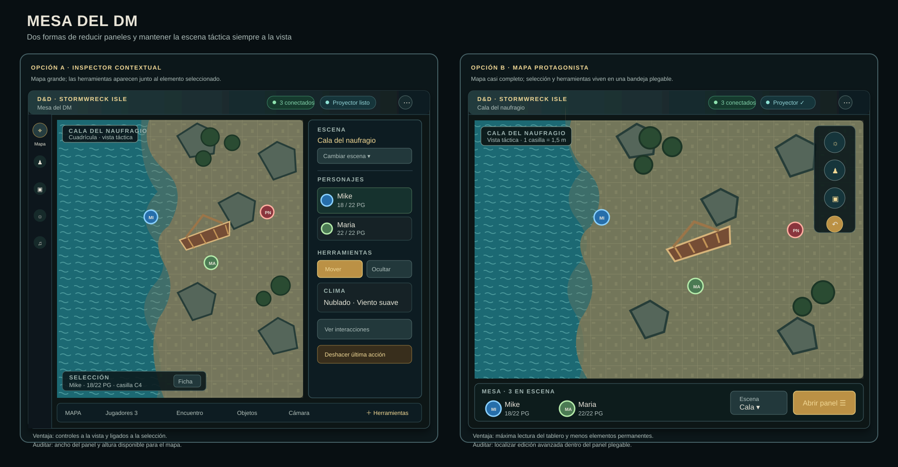
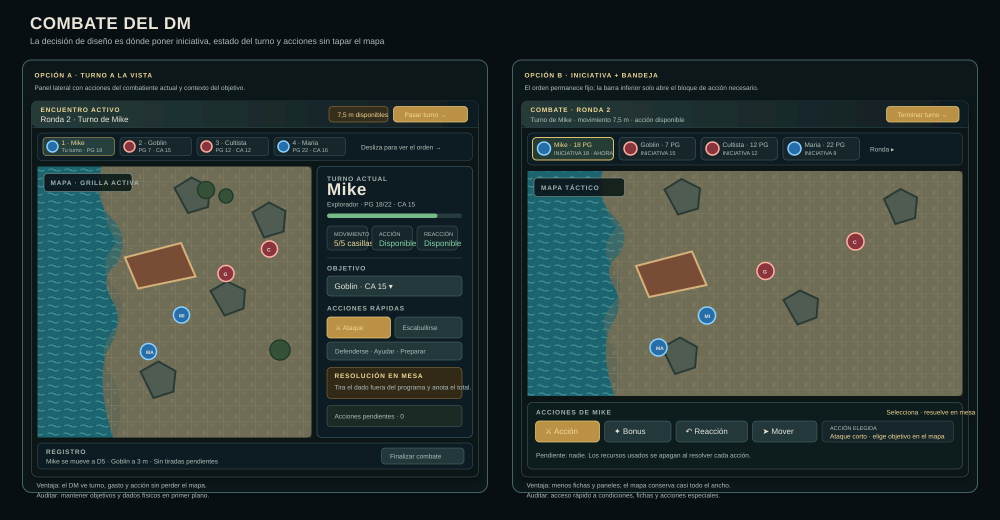
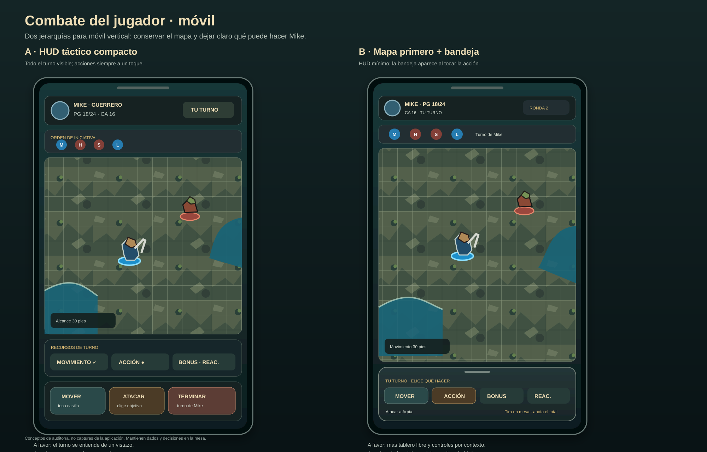

# Auditoría visual de interfaces

Estas láminas son propuestas de distribución para revisar antes de cambiar el juego. No son capturas del estado actual ni se ha modificado la aplicación. El estilo conserva el mapa táctico pixel art, la cuadrícula, los retratos/tokens y la paleta de fantasía oscura.

## Mesa del DM

La mesa actual funciona como un espacio de paneles movibles y redimensionables, con varios diseños preestablecidos. Un rail lateral abre secciones como mesa, clima y sonido; el área de trabajo combina el mapa con herramientas para escena, jugadores, PNJ, encuentro, cámaras y edición. Esta flexibilidad sirve para dirigir, pero el volumen de controles puede repartir la atención entre muchos paneles y hacer que el mapa pierda protagonismo.

La lámina compara dos enfoques: **A** conserva un inspector contextual junto al mapa para encontrar rápido los controles de escena y el estado seleccionado; **B** da más área al mapa y guarda herramientas secundarias en una bandeja plegable. Para una partida normal, B parece el mejor punto de partida; A puede ser más práctico cuando el DM prepara o edita una escena.

## Combate del DM

El flujo actual permite iniciar combate, recoger e introducir la iniciativa tirada en mesa, revisar el orden, confirmar la ronda y gestionar turno, PG, CA, condiciones, objetivos y acciones. Esa cobertura es útil; el riesgo de interfaz está en tener que alternar entre el mapa, las fichas de participantes y el panel de acciones, especialmente con una ventana estrecha.

La opción **A** mantiene turno, recursos, objetivo y resolución manual en un inspector lateral. La opción **B** prioriza el mapa y acerca la iniciativa y las acciones al borde inferior. A facilita arbitrar; B facilita leer el tablero. Una mezcla sensata sería iniciativa compacta siempre visible y acciones contextuales solo para el participante seleccionado.

## Combate del jugador en móvil

La interfaz actual superpone al mapa la identidad y estado del personaje, orden de iniciativa, recursos, objetivos y controles del turno. En vertical, la acumulación de avisos, leyenda, HUD y controles puede reducir el espacio útil del mapa; en combate el joystick puede dejar de ser el control principal y las acciones pasan a ser explícitas.

La opción **A** presenta salud, iniciativa, recursos y acciones de forma persistente, con botones grandes. Es fácil de entender, aunque tapa más tablero. La opción **B** deja más espacio al mapa y abre una bandeja de turno con movimiento, acción, acción adicional y reacción. Es más cómoda para jugar en móvil si la bandeja se puede plegar y nunca cubre al personaje o al objetivo seleccionado.

## Qué auditar al elegir

- ¿Se ve de inmediato quién tiene el turno y qué debe hacer el jugador?
- ¿El DM puede resolver el turno sin buscar el control entre paneles?
- ¿En móvil se distinguen con claridad objetivo, casillas alcanzables y personaje seleccionado?
- ¿Los botones se pueden tocar con una mano y no quedan debajo del pulgar o del navegador?
- ¿Los paneles plegables recuerdan su estado, pero se pueden recuperar fácilmente?
- ¿El mapa conserva suficiente espacio en móvil vertical y horizontal?
- ¿Los colores y rótulos distinguen aliados, hostiles, selección y casillas válidas sin depender solo del color?
- ¿La interfaz deja explícito que las tiradas se hacen con dados físicos y el DM toma las decisiones?

## Dirección recomendada

Empezar por mapa primero en las tres vistas; mantener iniciativa, conexión y turno en una franja breve; mostrar controles detallados solo para el elemento seleccionado; agrupar clima, sonido, cámara y edición en paneles plegables; y usar una bandeja táctil consistente en móvil. Antes de implementar, conviene escoger una opción por pantalla y anotar los problemas que se vean en las láminas.
